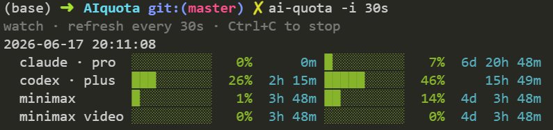

# ai-quota

AI coding-plan quota (MiniMax / OpenAI Codex / Claude Code) in the terminal. Zero runtime dependencies, read-only GETs, no quota consumed.

## Install

```bash
./install.sh
```

> **Z:/networked drives**: the repo's `.npmrc` sets `bin-links=false`; pass `--bin-links=true` to `npm link`, or run `npm link` from outside the project so the per-project `.npmrc` doesn't apply.

`npm link` symlinks `<prefix>/bin/ai-quota` → this repo's `dist/cli.js`. Re-running `npm run build` (or `./install.sh`) refreshes the binary in place — no re-link needed. Unlink with `npm unlink -g ai-quota`.

## Usage



<!-- OpenAI / Claude blocks have the same shape, with their own provider line (`OpenAI Codex` / `Claude Code`).  -->
Color coding: green (< 50%), yellow (< 80%), red (≥ 80%).

```bash
ai-quota                                  # all three providers
ai-quota --provider minimax --region intl # or: openai / claude
ai-quota --watch -i 30s                   # refresh in place every 30s
```

Auth: `MINIMAX_API_KEY` env (or `--key`); OpenAI reads `~/.codex/auth.json`; Claude reads `~/.claude/.credentials.json`. A missing provider doesn't abort the others.

### Watch mode

`--watch` refreshes in place until Ctrl+C. `--interval` (`-i`) implies `--watch`; accepts `30`, `30s`, `1m`; default `60`.

- **TTY**: cursor retract + clear-below, no flicker.
- **Pipe**: append mode, full history preserved.
- **Errors**: transient (network, timeout, 429) retry. 429 triggers **exponential backoff** (`2×, 4×, …` capped at 5 min, resets on success). Fatal (auth, other 4xx/5xx, missing config) exits with code 2.

### Options

| Flag                                       | Description                                                                                          |
| ------------------------------------------ | ---------------------------------------------------------------------------------------------------- |
| `-p, --provider <minimax\|openai\|claude>` | Single provider (default: all three)                                                                 |
| `-k, --key <KEY>`                          | MiniMax API key (or env `MINIMAX_API_KEY`)                                                           |
| `-r, --region <cn\|intl>`                  | MiniMax endpoint (default `cn`)                                                                      |
| `-g, --group-id <ID>`                      | MiniMax group ID (optional)                                                                          |
| `--codex-auth <PATH>`                      | Codex auth (default `$CODEX_HOME/auth.json` or `~/.codex/auth.json`)                                 |
| `--claude-auth <PATH>`                     | Claude credentials (default `$CLAUDE_CONFIG_DIR/.credentials.json` or `~/.claude/.credentials.json`) |
| `-w, --watch`                              | Refresh in place (implied by `-i`)                                                                   |
| `-i, --interval <SECS>`                    | Refresh interval (`30`/`30s`/`1m`, default `60`; implies `-w`)                                       |
| `-h, --help`                               | Show help                                                                                            |
| `-v, --version`                            | Show version                                                                                         |

Env: `NO_COLOR=1`, `CODEX_HOME`, `CLAUDE_CONFIG_DIR`.

## How it works

Three read-only GETs, no side effects.

| Provider     | Auth                                           | Endpoint                                                                                                  |
| ------------ | ---------------------------------------------- | --------------------------------------------------------------------------------------------------------- |
| MiniMax      | `MINIMAX_API_KEY`                              | `https://api.minimaxi.com/v1/api/openplatform/coding_plan/remains` (intl: `minimax.io`)                   |
| OpenAI Codex | OAuth JWT from `~/.codex/auth.json`            | `https://chatgpt.com/backend-api/wham/usage` — must use Codex-style headers; `api.openai.com` returns 401 |
| Claude Code  | OAuth token from `~/.claude/.credentials.json` | `https://api.anthropic.com/api/oauth/usage` — requires `anthropic-beta: oauth-2025-04-20`                 |

OpenAI retries 3× on transient `UND_ERR_CONNECT_TIMEOUT` (Cloudflare). Claude retries 3× on transient network errors. See [claude-code-quota](https://github.com/aweussom/claude-code-quota) for the Claude endpoint reverse-engineering notes; [minimax-coding-plan-quota-query](https://github.com/yunluoxin/minimax-coding-plan-quota-query) for MiniMax.
