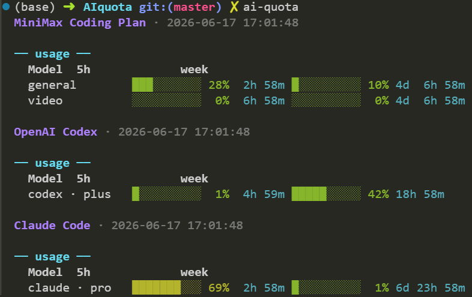

# ai-quota

Show AI coding-plan quota (MiniMax / OpenAI Codex / Claude Code) in the terminal. Zero runtime dependencies.

## Install

```bash
npm install
npm run build
npm link --bin-links=true   # exposes `ai-quota` on PATH
```

> **Note for Z:/networked drives:** the repo's `.npmrc` sets `bin-links=false` because those filesystems don't support symlinks. `npm link` will register the package but won't create the `bin` symlink. Override with `--bin-links=true` (or run `npm link` from outside the project so the per-project `.npmrc` doesn't apply).

## Usage



By default `ai-quota` queries **all three** providers in parallel and prints each result. Use `--provider` to limit to a single one.

```bash
# All three providers (default)
ai-quota
export MINIMAX_API_KEY=sk-cp-xxxxxxxx   # needed for the MiniMax block
ai-quota                                  # MiniMax + OpenAI Codex + Claude Code in one run

# Single provider
ai-quota --provider minimax --region intl
ai-quota --provider openai                # reads ~/.codex/auth.json
ai-quota --provider claude                # reads ~/.claude/.credentials.json
```

Or pass the MiniMax key directly:

```bash
ai-quota --provider minimax --key sk-cp-xxxxxxxx
```

If the MiniMax key is missing in default mode, only the available blocks are printed — failure of one provider does not abort the others.

### Options

| Flag                                       | Description                                                                                               |
| ------------------------------------------ | --------------------------------------------------------------------------------------------------------- |
| `-p, --provider <minimax\|openai\|claude>` | Single provider (default: all three)                                                                      |
| `-k, --key <KEY>`                          | MiniMax API key (or env `MINIMAX_API_KEY`)                                                                |
| `-r, --region <cn\|intl>`                  | MiniMax endpoint (default `cn`)                                                                           |
| `-g, --group-id <ID>`                      | MiniMax group ID (optional query param)                                                                   |
| `--codex-auth <PATH>`                      | Codex `auth.json` path (default `$CODEX_HOME/auth.json` or `~/.codex/auth.json`)                          |
| `--claude-auth <PATH>`                     | Claude credentials path (default `$CLAUDE_CONFIG_DIR/.credentials.json` or `~/.claude/.credentials.json`) |
| `-h, --help`                               | Show help                                                                                                 |
| `-v, --version`                            | Show version                                                                                              |

Environment: `NO_COLOR=1` disables ANSI colors. `CODEX_HOME` overrides the default Codex home directory; `CLAUDE_CONFIG_DIR` overrides the default Claude home directory.

## Output

### MiniMax

```
MiniMax Coding Plan · 2026-06-17 11:38:11

── usage ──
  Model          5h                     week
  MiniMax-M3     ██░░░░░░░  25%  4h 58m ███░░░░░░░  30%  6d 22h 50m
  MiniMax-M2     █████████▌  96%  14m    ████████░  84%  1d 1h 33m
```

### OpenAI Codex

```
OpenAI Codex · 2026-06-17 16:25:21

── usage ──
  Model          5h                 week
  codex · plus   ██████░░░░ 54% 34m █████░░░░░ 42% 19h 34m
```

### Claude Code

```
Claude Code · 2026-06-17 16:52:34

── usage ──
  Model          5h                     week
  claude · pro   ██████░░░░ 53%  3h  7m ████████░ 71%  7m
```

Color coding: green (< 50%), yellow (< 80%), red (≥ 80%).

## How it works

### MiniMax

Calls `GET /v1/api/openplatform/coding_plan/remains` on the chosen region's MiniMax API with a Bearer token. The response's `model_remains` is split into a 5-hour window and a weekly window per model. See [API info](https://github.com/yunluoxin/minimax-coding-plan-quota-query).

### OpenAI Codex

Reads `~/.codex/auth.json` for the ChatGPT OAuth JWT (set up via `codex login`), then `GET`s `https://chatgpt.com/backend-api/wham/usage` with Codex-style headers. The response is JSON containing the active 5-hour window (`primary_window`) and weekly window (`secondary_window`), plus `plan_type`, `credits`, and `spend_control`.

The headers (`User-Agent: codex_cli_rs/0.0.0`, `OpenAI-Beta: responses_websockets=2026-02-06`, `session-id`, `thread-id`, `chatgpt-account-id`) make the request look like Codex CLI traffic to the ChatGPT backend. Sending the JWT to `api.openai.com` instead returns 401 "Missing scopes" — ChatGPT Plus tokens are not authorized for the OpenAI API gateway.

The call is a single read-only GET: **no tokens consumed, no side effects**. Retries 3× on transient `UND_ERR_CONNECT_TIMEOUT` (Cloudflare fronting `chatgpt.com` is flaky from some networks).

### Claude Code

Reads `~/.claude/.credentials.json` for the Claude Code OAuth access token (set up via `claude login`), then `GET`s `https://api.anthropic.com/api/oauth/usage` with the `anthropic-beta: oauth-2025-04-20` header that the endpoint requires. The response is JSON with two utilization windows — `five_hour` (current session, percentage used) and `seven_day` (weekly, percentage used) — each with an ISO 8601 `resets_at` timestamp. `extra_usage` (when `is_enabled`) shows pay-as-you-go consumption.

The endpoint shape and required beta header were reverse-engineered by [aweussom/claude-code-quota](https://github.com/aweussom/claude-code-quota) from the Claude Code CLI. The call is a single read-only GET: **no tokens consumed, no side effects**. Retries 3× on transient network errors.

## Endpoints

| Provider | Region | URL                                                                |
| -------- | ------ | ------------------------------------------------------------------ |
| MiniMax  | cn     | `https://api.minimaxi.com/v1/api/openplatform/coding_plan/remains` |
| MiniMax  | intl   | `https://api.minimax.io/v1/api/openplatform/coding_plan/remains`   |
| OpenAI   | —      | `https://chatgpt.com/backend-api/wham/usage`                       |
| Claude   | —      | `https://api.anthropic.com/api/oauth/usage`                        |

Coding Plan keys (`sk-cp-…`) only work on the platform that issued them; pass `--region` to match.

## License

MIT
