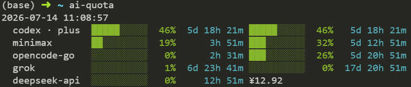

<h1>ai-quota</h1>

> AI剩余额度查询，推荐搭配pi-agent使用   
> Zero runtime dependencies, read-only GETs, no quota consumed.   

> 授权文件从~/.pi/agent/auth.json读取。



## 1 Supports
- [x] Claude code         : `~/.claude/.credentials.json`
- [x] OpenAI Codex        : `~/.codex/auth.json`
- [x] Grok build          : `~/.pi/agent/auth.json`
- [x] Opencode go         : `~/.config/ai-quota/opencode.env`
- [x] Minimax coding plan : `MINIMAX_CN_API_KEY` or `MINIMAX_API_KEY` env
- [x] DeepSeek API        : `DEEPSEEK_API_KEY`

## 2 Usage

```bash
bun install -g ai-quota # install
```

Color coding: green (< 50%), yellow (< 80%), red (≥ 80%).

```bash
ai-quota auth list                    # see which providers are enabled
ai-quota auth disable opencode        # skip a provider next time
ai-quota auth enable opencode         # bring it back

ai-quota                              # all enabled providers
ai-quota -p minimax                   # one-off override; ignores auth config
ai-quota -i 30s                       # refresh in place every 30s
```

## 3 API daily usage budget

`api-usage` shows **account balance** and local **daily + weekly budget progress** for DeepSeek (`provider: deepseek-api`). It reads `GET /user/balance`; this is a read-only balance check, not a model call.

```bash
export DEEPSEEK_API_KEY="sk-..."

api-usage                         # default daily 7 / weekly 35 CNY
api-usage --budget 10             # override daily budget to 10 CNY
api-usage --weekly-budget 50      # override weekly budget to 50 CNY
api-usage --watch -i 30s          # refresh in place every 30s
api-usage --reset-today           # reset today's + this week's baseline
api-usage --currency USD          # show USD balance if the account has USD balance_infos
```

Output shape:

```text
2026-07-02 20:20:04
  provider       deepseek-api
  account        ¥ 18.07 total  (¥ 0.00 granted + ¥ 18.07 topped-up)
  weekly budget  ¥ 35.00 left / ¥ 35.00  ░░░░░░░░░░░░░░░░░░░░░░░░ 0.0% used
  daily budget   ¥  7.00 left / ¥  7.00  ░░░░░░░░░░░░░░░░░░░░░░░░ 0.0% used
  today spent    ¥ 0.00 since 2026-07-02
  day baseline   ¥ 18.07  2026-07-02T12:20:04.949Z
  week spent     ¥ 0.00 since 2026-06-29
  week baseline  ¥ 18.07  2026-07-02T12:20:04.949Z
```

State persisted in `~/.config/ai-quota/api-usage.json`:
- **account ledger** — stores `last_balance` and `updated_at`, so the next run can persist the balance drop since the previous run.
- **daily record** — first run of each local day stores a baseline; later runs accumulate balance drops into that day's `spent`.
- **weekly record** — first run of each ISO week (Monday-start) stores a baseline; later runs accumulate balance drops into that week's `spent`.
- **top-ups** — balance increases update `last_balance` but do not reduce recorded `spent`.
- `--reset-today` resets both records to the current balance and clears recorded `spent`.

Budget amounts are persisted once set (CLI > env > state). Env vars: `DEEPSEEK_DAILY_BUDGET` / `DEEPSEEK_WEEKLY_BUDGET`. DeepSeek's public API only exposes `/user/balance`; this is a local spend ledger, not a server-side cap.
