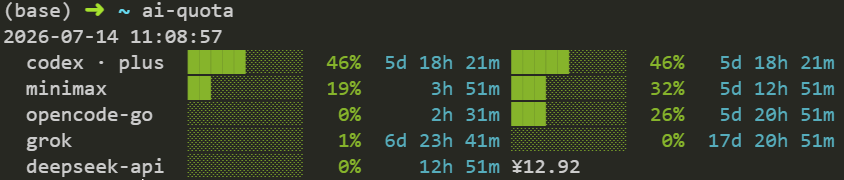

<h1>ai-quota</h1>

> AI剩余额度查询，推荐搭配pi-agent使用   
> Zero runtime dependencies, read-only GETs, no quota consumed.   



> Color: green (< 50%), yellow (< 80%), red (≥ 80%).

## ai-quota

- [x] Claude code         : `~/.claude/.credentials.json`
- [x] OpenAI Codex        : pi `openai-codex`（legacy）或 `~/.codex/auth.json`
- [x] Grok build          : `~/.pi/agent/auth.json`
- [x] Opencode go         : `~/.config/ai-quota/opencode.env`
- [x] Minimax coding plan : `MINIMAX_CN_API_KEY` or `MINIMAX_API_KEY` env
- [x] DeepSeek API        : `DEEPSEEK_API_KEY`
- [x] Kimi coding plan    : **待测试**，`KIMI_API_KEY` or `MOONSHOT_API_KEY` env
- [x] Zhipu coding plan   : **待测试**，`ZHIPU_CN_API_KEY` or `ZHIPU_API_KEY` env (cn/intl regions)

Pi 新版 `/login openai` 的应用额度显示为 `openai·apps`，与普通 Codex 额度分开。使用 Codex 凭据查询 `/wham/usage/chatpass/apps`，按新版 token 的 `client_id` 唯一匹配当前应用，显示 5 小时和周窗口；不以配置上限或其他应用额度代替。两种登录须对应同一 ChatGPT 账号/工作区。

查询仍需 pi `openai-codex`（legacy）或 Codex 凭据：新版 `openai` token 面向 `api.openai.com/v1`，实测无法读取 WHAM。仅有新版凭据时提示查看 [ChatGPT Usage](https://chatgpt.com/settings/usage)。不刷新或改写共享凭据。详见 [接口核查](docs/openai-auth.md)。

**Usage**

```bash
bun install -g ai-quota # install
```

```bash
ai-quota auth list                    # see which providers are enabled
ai-quota auth disable openai          # skip a provider next time
ai-quota auth enable openai           # bring it back

ai-quota                              # all enabled providers
ai-quota -p minimax                   # set one provider
ai-quota -i 30s                       # refresh in place every 30s
ai-quota query reset-card -p codex    # show Codex reset cards

# 1week 10￥ / 1mon 70￥
ai-quota budget -p deepseek-api -w 10 -m 70
```

## ee-quota (Earth Engine quota)

1. 完成 Earth Engine 授权并设置项目：

```bash
earthengine authenticate
earthengine set_project <PROJECT_ID>
```

2. 在网页右上角选择该项目，分别打开并点击**启用**：

- [Cloud Quotas API](https://console.cloud.google.com/apis/library/cloudquotas.googleapis.com)
- [Cloud Monitoring API](https://console.cloud.google.com/apis/library/monitoring.googleapis.com)

若无法启用，请让项目所有者进入 [IAM](https://console.cloud.google.com/iam-admin/iam)，点击**授予访问权限**，添加你的 Google 账号，并授予 **Service Usage Admin** 角色。

3. 启用项目并查询月额度：

```bash
ee-quota auth enable gee-hydro
ee-quota auth enable gee-kongdd
ee-quota auth list
ee-quota auth disable gee-kongdd

ee-quota config --unit h   # s 或 h
ee-quota                   # 所有已启用 project
ee-quota -p gee-hydro      # 指定 project
```

Earth Engine 凭据默认位于 `~/.config/earthengine/credentials`，详见 [Earth Engine Authentication](https://developers.google.com/earth-engine/guides/auth)。
